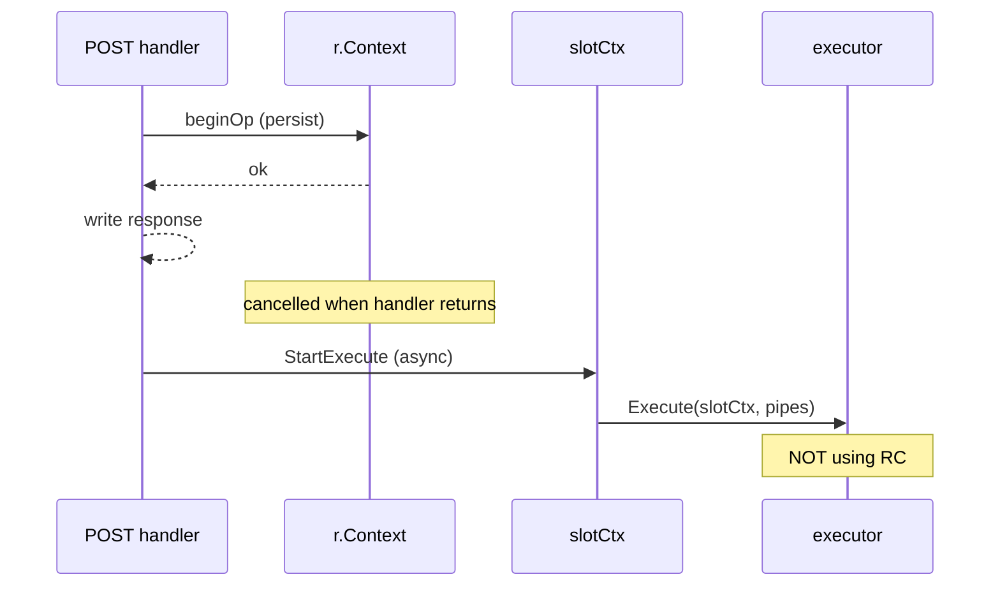

# secret-agent design notes

Concise record of settled constraints and open tensions. Supersedes parts of `plan-process-io.md` (that doc describes old `process/io` polling).

## Domain model

- **Secret** — versioned plan (scripts for create/activate/…).
- **Instance** — deployed copy of a secret; many instances, **one active** per secret.
- **Operation** (`secrets.Operation`) — audit record: op number, name, status, timestamps. Not the same as HTTP attach state.
- **Per secret**, mutating work is effectively **serial** for a given principal; reads (`List`/`Get`) are unconstrained.

## Layering

| Layer | Package (target) | Role |
|-------|------------------|------|
| **Catalog** | `store` | Read-only: secrets, instances, operation history. |
| **Runner** | `store` | `Run(name, target, params, proposer, stdio)` — blocking mutation + I/O. |
| **Porcelain** | `ops` (separate) | Typed `Create`/`Activate`/… calling `Runner.Run`. CLI imports `ops`, not raw runner. |
| **HTTP** | `server` | Attach routes + JSON start; maps to runner semantics. |
| **Execute** | `executor` | Run subprocess; **`executor.OperationParameters`** is the single domain params type. |
| **Wire DTOs** | `server` | JSON request bodies only (e.g. `RunRequest`); map to `executor.OperationParameters` + peer identity. |

## HTTP attach (current direction)

- **Attach before start**: open stdio upgrades, then POST start/run.
- **Slot key**: `(secretId, principal)` — principal from transport (Unix peer creds), not request body.
- **One slot per (secret, principal)**; no reattach; **disconnect = cancel** op.
- Routes (target shape): `POST /secrets/{secretId}/attach/{stdin|stdout|stderr}` → then `POST …/instances` or `…/operations`.
- Server in-memory type: **`attachSlot`** (not `operation`) — pipes, attach claims, `startedBy`. Registry keyed by `(secretId, principal)` until op number exists.

## Store `Run` — caller feedback & cancellation

**Not two moments — an active session.** Caller receives:

| When | What |
|------|------|
| Op recorded | `Instance` (op number, `startedAt`, …) |
| During run | **stdio** streams; **`Propose`** callbacks for dependent-secret auth |
| Op finished | final `*Instance` (`completedAt` or `failedAt`); failure via **`error`** |

**Start / Wait split:** **`Run`** returns the accepted snapshot quickly; **interactive work runs in the background** as soon as accept completes. **`Wait`** is a **join** (like `sync.WaitGroup.Wait`) — block until that work finishes. Callable **any number of times**; all calls get the same terminal `(instance, err)`.

**Two cancellation lifecycles** (tension with Start/Wait):

1. **Start (HTTP POST)** — runs under **`r.Context()`** only long enough to validate, persist op, return `Instance`. Request ends; that ctx must **not** bound subprocess or attach pumps.
2. **Run (async)** — stdio, proposals, executor run under **attach-slot / conn lifetime**, not the start request ctx.

Locally, `Run` + immediate `Wait(ctx)` can share the caller’s ctx. **HTTP is asymmetric:** start is request-scoped; the op continues on attach connections (server) or client-held conns after POST returns.

**Design rule:** server never passes `r.Context()` from POST start into `Execute` or attach copy loops. Slot cancel = attach disconnect or explicit cancel API, not “response sent”.

**Likely shape:**

```go
type Wait func(ctx context.Context) (instance *secrets.Instance, err error)

Runner.Run(...) (instance *secrets.Instance, wait Wait, err error)
```

**Background work starts before `Run` returns** (not on first `Wait`):

| Path | What starts in background when `Run` succeeds |
|------|-----------------------------------------------|
| **sqlite** | Goroutine: `executor.Execute` + complete op in DB |
| **HTTP client** | Goroutine: pump attach (server already `StartExecute` after POST) |
| **HTTP server** | Slot `StartExecute` after POST response (no `Wait` on wire) |

**`Wait` = join:** blocks until background work completes; **idempotent** — safe to call from multiple goroutines or twice in sequence. **`wait(ctx)`** ctx cancels **waiting only** (caller unblocks); it does not stop an in-flight op unless attach disconnect / slot cancel applies. If `Run` returns `err != nil`, **`wait` is nil**.

### Unified invariant (both store implementations)

**Subprocess starts when I/O is ready at the end of accept — never when the caller first calls `wait`.**

If HTTP only started the op on `wait`, attach-before-start would be pointless (you could POST, attach, then “really start” on await). Attach-first exists precisely so **streams are connected before `Execute`**, with start triggered by **POST + slot `StartExecute`**, not by the client’s join.

| | When is I/O ready? | When does `Execute` start? | What does `wait` do? |
|--|-------------------|---------------------------|----------------------|
| **sqlite** | `Run` has `command.Stdio` in-process | **`launchAsync` today** — goroutine before `Create` returns | Join on `operationRuntime.done` (today’s `Await`) |
| **HTTP** | Attach upgrades done + POST accepted | **Server** `StartExecute` after POST (client pump goroutine runs in parallel) | Join pump + terminal instance |

**Historical “delay until attach” (Jul 2025):** for **HTTP / federation**, not sqlite. Problems it solved:

1. **Fast-script race** — subprocess must not run until stdio streams exist (otherwise exit before attach, or block on full pipe buffers).
2. **Decoupled attacher** — ~~starter ≠ attacher (human B attaches later)~~ **replaced:** orchestrator A is always starter+attacher on B; B gates on **John’s authorisation proof**, not a second attach principal (federation; Phase 8).

That delay is **“until attach + start gate”**, not **“until `wait()`”**. Attach-before-start is the gate: attach streams → POST → then execute. Sqlite has no transport gap — stdio is wired before any goroutine starts — so no attach delay; it still matches the invariant because execute starts at end of accept with I/O already connected.

**Today’s code:** `internal/sqlite/store.go` already does this — `Create` calls `launchAsync` (starts `completeOperation` in a goroutine), and `Await` only waits on `rt.done`. Phase 3 maps `Runner.Run` → persist + `launchAsync`; `Wait` → today’s `await`. Do not reintroduce execute-on-wait.

Success after join: terminal instance with **`completedAt`**, `err == nil`.  
Failure: **`failedAt`** in store, `err != nil` — **`errors.As`** for typed exit error when subprocess exited non-zero.

- **HTTP:** POST start → initial `Instance`; attach conns + control channel carry stdio/proposals until done.
- Drop **`/result` long-poll** and **`trackOperation`** once Wait/attach own completion.

## Parameters naming

- **`executor.OperationParameters`** — domain (reason, forced, env, startedBy, expectedOpNumber).
- **`server.RunRequest`** (rename from `OperationParameters`) — JSON subset; controller sets `StartedBy` from identity.

## Proposer

- **`Proposer`** on **`Runner.Run(...)`** — invoked from **inside** a parent op script when a dependent op on another secret/host is needed (Phase 8).
- **`Propose(ctx, name, params) error`** — nil = approved; error = rejected. Blocks the parent script until resolved.

**Federated shape (sketch):** parent host **A** must not be able to approve on **John’s** behalf by assertion alone. One viable implementation:

1. Script on A hits `Propose` for an op on host **B**.
2. **A forwards a pipe** (e.g. SSH `-L` / socket forward) so **John talks to B directly** — prompt, challenge, or confirm UI on B’s side.
3. **John authenticates to B** (peer creds, SSH, mTLS, … — B verifies John, John verifies B).
4. **John’s OK** is recorded **by B** (signed approval, session on B, audit row) — not “A says John OK’d”.

**Threat model:** **A must not MITM John ↔ B.** A may relay bytes for stdio of the parent op and for a **forwarded authorisation channel**, but must not be able to forge John’s approval or impersonate B to John. Concretely:

| Allowed | Not allowed |
|---------|-------------|
| A forwards a channel; John establishes **E2E trust with B** | A sends `approved: true` on B’s API with no John↔B auth |
| B issues nonce/challenge; **John’s response verified by B** (key/credential B already trusts) | A replays or edits John’s response |
| Parent op on A blocks in `Propose` until B records John’s decision | Policy “trust parent op X” **without** a John↔B step when cross-host |

Same-host tests can use two Unix peers (John vs A) with the same logic: B still verifies **John**, not A’s say-so.

No behaviour in sqlite yet; HTTP control stream for `Propose` deferred (see Open).

## Catalog / Runner split — why

1. **Different contracts** — catalog calls are idempotent reads; runner holds blocking I/O, proposer, and `(secret, principal)` attach semantics.
2. **HTTP mapping** — GET handlers vs attach + POST; awkward to implement `List` on something that also needs `Run(..., stdio)`.
3. **Testing / mocks** — list/get tests without stubbing stdio or proposer.
4. **Future aggregate “web” API** — catalog can fan out across hosts; runner stays on the agent that executes the secret.
5. **Mental model** — browse secrets ≠ run an op (same as k8s list/get vs attach/exec).

If the split feels heavy, minimum viable split is still **`Runner` only for mutations**; catalog can remain nested accessors on the same concrete type.

## Exit code

- **Not stored** on `secrets.Operation` / instance status — only **`completedAt`** vs **`failedAt`** (already what sqlite `completeOperation` does).
- **Non-zero subprocess exit** → op marked **`failedAt`**, `Wait` returns **`err != nil`**. Caller uses **`errors.As(err, *command.ExitError)`** (or similar) for the numeric code when needed (CLI exit status, logging).
- **Exit code 0** → **`completedAt`**, `err == nil`.
- **Other failures** (start failed, ctx canceled, DB error) → also `err != nil`; only subprocess exits carry an exit code on the error. No parallel `ExitCode` field on store types.
- **`command.Process`** should wrap with **`%w`** so `exec.ExitError` survives (today it does not).

## Federation (later)

Supersedes the “U@C starts, human B attaches later” sketch in `plan-process-io.md`.

**Starter is always attacher.** No decoupled second connection from a different principal to attach stdio.

Example: John runs an op on **host A**; the script triggers a dependent op on **host B**.

| Host | Who runs the op (transport) | `startedBy` on audit row | Who attaches stdio |
|------|----------------------------|--------------------------|-------------------|
| **A** | John | John | John (local CLI or John’s client session) |
| **B** | **Host A** (orchestrator) | **Host A** | **Host A** — same connection/session that started the op |

**Attach rule unchanged:** `transport principal == startedBy` on that host. On B, A is both starter and attacher.

**What B must gate on:** **John’s authorisation for this specific op on B at this time** — verified **on B**, not taken on faith from A.

**How (Phase 8 — not v1):** A is starter+attacher on B for **stdio of B’s script**. **John’s consent** is a separate leg: A’s `Proposer` may **forward a pipe** so John authenticates **directly to B** and B records OK. B then allows A’s attach/start (or unblocks a pending proposal). A must not be able to MITM that leg — see **Proposer** § threat model. Reject designs where A submits a bearer “John approved” token B cannot cryptographically or session-wise tie to John.

**Implications for attach-before-start:** unchanged for A↔B stdio — A attach slot, POST, `StartExecute`. **Authorisation** may complete inside `Propose` (blocking parent on A) before A POSTs start on B, or B holds start until John’s OK is on record — exact ordering TBD in Phase 8.

**Audit:** B’s op records `startedBy = A`; John’s involvement is in the **authorisation proof** and/or parent op on A (reason chain, proposer log), not as B’s transport principal.

## Open / deferred

- Startup cleanup of DB ops stuck without `completedAt` after agent restart (attach fails; row may lie until cleaned).
- Orphan slot if attach never followed by start (timeout?).
- Control stream for `Proposer` on HTTP (4th upgrade vs mux).
- Real exit code over HTTP attach (typed error on remote client; local caller still has stderr).

---

## Decisions (Phase 0)

Written before Phase 1 implementation. Wire details: [`http-api.md`](http-api.md).

### 0.1 Store surface

| Question | Decision |
|----------|----------|
| Top-level type | **`Agent`**: `Catalog()` + `Runner(secretId string)` |
| Target | **No `Target` struct.** `Runner` is bound to `secretId`; `Run` takes **`instanceId string`** (empty = create). |
| Op name | **`secrets.OperationName`** |
| History | **`Catalog.Operations().List(...)`** only; runner does not list |
| `Run` return | **`(*Instance, Wait, error)`** — accept snapshot + **join** closure (background already running) |

**Copy-pasteable signatures:**

```go 
package store

type Agent interface {
    Catalog() Catalog
    Runner(secretId string) Runner
}

type Catalog interface {
    Secrets() Secrets
    Instances() Instances
    Operations() Operations
}

type Secrets interface {
    List(ctx context.Context) (secrets.Secrets, error)
    Get(ctx context.Context, secretId string) (*secrets.Secret, error)
}

type Instances interface {
    List(ctx context.Context, secretId *string, from, to int) (secrets.Instances, error)
    Get(ctx context.Context, instanceId string) (*secrets.Instance, error)
    GetActive(ctx context.Context, secretId string) (*secrets.Instance, error)
}

type Operations interface {
    List(ctx context.Context, secretId, instanceId *string, from, to int) ([]*secrets.Operation, error)
}

type Runner interface {
    Run(
        ctx context.Context,
        name secrets.OperationName,
        instanceId string, // empty for create
        params executor.OperationParameters,
        proposer Proposer,
        stdio command.Stdio,
    ) (instance *secrets.Instance, wait Wait, err error)
}

type Wait func(ctx context.Context) (instance *secrets.Instance, err error)

type Proposer interface {
    Propose(ctx context.Context, name secrets.OperationName, params executor.OperationParameters) error
}
```

**Server vs `Agent`:** HTTP server holds a concrete **`store.Agent`** (sqlite). Controller does **not** expose `Runner` to handlers directly; POST start uses the same sqlite `Begin` path as `Run`’s first phase, then **`attachSlot`** runs `Execute` on **slot context**. Only **client and in-process CLI** call `Run` + `Wait` end-to-end.

**Snapshots:** first `*Instance` from **`Run`** = op accepted (`startedAt`). **`Wait`** returns the terminal instance (`completedAt` or `failedAt`). Same type, different moment — distinguished by call, not wrapper structs.

**Why `Wait` is a func type:** each `Run` returns a closure that **joins** shared completion state (goroutine + `sync.WaitGroup` or equivalent). Not “start work here” — work already started before `Run` returned.

**Why execute used to be documented on `Wait`:** a documentation mistake — conflated HTTP attach gating with the join handle. **Current sqlite already executes on accept** (`launchAsync`); **`Await` joins only.** The new `Runner`/`Wait` names map directly to that behaviour.

**Why `Operations` not `OperationsHistory`:** Same accessor name as today’s catalog surface; only **`List`** remains (mutations moved to `Runner`). Distinct from `secrets.Operation` (audit row type) — package prefix disambiguates.

**Active instance:** **`Instances.GetActive(ctx, secretId)`** + **`GET /secrets/{secretId}/active`** — kept as a singular read (not a list filter); see [`http-api.md`](http-api.md).

### 0.2 `Run` / `Wait` contract

**Phases:**

| Phase | Who | What runs |
|-------|-----|-----------|
| **Accept** | `Runner.Run` (sync) | Persist op; HTTP client: attach + POST. Return accepted `*Instance` + `Wait` join handle. |
| **Background** | Goroutine / slot (async) | Sqlite: `Execute` + DB complete. HTTP client: pump attach. Server: slot `StartExecute` after POST. |
| **Join** | `wait(ctx)` (any caller, any number of times) | Block until background done; return terminal `(instance, err)`. |

**Who passes `stdio` / `proposer`?**

| Implementation | `Run(..., stdio, proposer)` | Background | `Wait` |
|----------------|----------------------------|------------|--------|
| **sqlite** | Passed into background `Execute` goroutine started before `Run` returns | **`Execute`** | Join only |
| **HTTP client** | Attach in `Run`; pump uses stdio in background goroutine | **Pump attach** (server executes after POST) | Join only |
| **HTTP server POST** | Slot pipes bound before POST | **`StartExecute` on slot** after response | Not used |

**Context rule (mandatory):** POST handler uses **`r.Context()`** only until op row + instance snapshot are persisted and JSON is written. **`Execute` and attach copy loops use `attachSlot.slotCtx`**, cancelled on stream disconnect or slot teardown. Never pass `r.Context()` into subprocess or attach pumps.

**Exit code:** subprocess non-zero → **`failedAt`** in DB + typed error from `Wait`. No **`ExitCode`** field on store results. **`command.ExitError`** (name TBD) wraps `exec.ExitError` for `errors.As`.

**HTTP client completion (replaces `/result` long-poll):**

1. `Wait` blocks until attach copies finish (server closed write end → EOF).
2. Reload instance; **`err == nil`** iff **`completedAt`** set.
3. If **`failedAt`** set → return instance **and** an error (`OperationFailed` or synthesized from attach session). Numeric exit code on remote attach deferred unless control channel adds it; **stderr** already streamed to caller.

**Cancel before POST start:** If attach disconnects before POST, **no op row** — slot torn down, nothing to roll back. If POST succeeds then client disconnects, **disconnect cancels** running op (slot `cancel()` → kill subprocess, mark op failed).

#### Pseudo-code — shared join (sqlite + client)

```go
type opDone struct {
    wg sync.WaitGroup
    mu sync.Mutex
    inst *secrets.Instance
    err  error
}

func (d *opDone) join(ctx context.Context) (*secrets.Instance, error) {
    ch := make(chan struct{})
    go func() { d.wg.Wait(); close(ch) }()
    select {
    case <-ctx.Done():
        return nil, ctx.Err() // abandoned join; background keeps running
    case <-ch:
        d.mu.Lock()
        defer d.mu.Unlock()
        return d.inst, d.err
    }
}

func (r *sqliteRunner) Run(ctx, name, instanceId, params, proposer, stdio) (*secrets.Instance, Wait, error) {
    inst, err := r.beginOp(ctx, name, instanceId, params)
    if err != nil { return nil, nil, err }
    done := &opDone{}
    done.wg.Add(1)
    go func() {
        defer done.wg.Done()
        err := r.execute(opCtx, inst, name, params, proposer, stdio)
        final, _ := r.instances.Get(context.Background(), inst.Id)
        done.mu.Lock()
        done.inst, done.err = final, err
        done.mu.Unlock()
    }()
    wait := Wait(done.join)
    return inst, wait, nil
}
```

#### Pseudo-code — HTTP server (POST handler)

```go
func (c *Controller) startOp(w, r, secretId, instanceId, name, params) {
    slot := c.slots.get(secretId, principal(r))
    if slot == nil || !slot.Ready() { return 409 }
    ctx := r.Context()
    inst, err := c.agent.Runner(secretId).Begin(ctx, name, instanceId, params) // or internal beginOp
    if err != nil { return err }
    writeJSON(w, inst)
    slot.StartExecute(slot.slotCtx, inst, name, params) // uses slot.pipes, not r.Context()
}
```

(`Begin` is the persist-only half of `Run`; may live as unexported helper on sqlite runner until Phase 1 names it.)

#### Pseudo-code — HTTP client

```go
func (r *clientRunner) Run(ctx, ...) (*secrets.Instance, Wait, error) {
    slot, err := r.openAttach(ctx, secretId)
    inst, err := r.postStart(ctx, ...)
    if err != nil { return nil, nil, err }
    done := &opDone{}
    done.wg.Add(1)
    go func() {
        defer done.wg.Done()
        pumpErr := slot.Pump(slotCtx, stdio) // started here, not in Wait
        final, _ := r.catalog.Instances().Get(context.Background(), secretId, inst.Id)
        // set done.inst, done.err from final + pumpErr / failedAt
    }()
    return inst, Wait(done.join), nil
}
```

#### Sequence — HTTP client

```mermaid
sequenceDiagram
    participant C as Client
    participant S as Server
    participant Slot as attachSlot
    participant DB as sqlite

    C->>S: POST attach/stdin,stdout,stderr (Upgrade)
    S->>Slot: create slot(principal)
    C->>S: POST …/operations (r.Context)
    S->>DB: begin op
    DB-->>S: Instance
    S-->>C: 200 Instance JSON
    S->>Slot: StartExecute(slotCtx)
    Note over C,S: POST ctx ends
    Note over C: Run starts pump goroutine
    Slot->>Slot: Execute + copy loops
    Slot-->>C: pipe EOF on done
    C->>C: wait(ctx) joins pump; returns instance + err
```

#### Sequence — server POST must not leak ctx



### 0.3 HTTP routes

See [`http-api.md`](http-api.md). Summary:

- **Remove** op-number attach paths, **`/result` long-poll**, **`DELETE …/operations/{n}`**.
- **Attach before start** on `/secrets/{secretId}/attach/{stdin|stdout|stderr}`.
- **v1 readiness:** require **stdout + stderr** attached before POST; **stdin required** if we want one simple rule — **require all three streams** for v1 (stricter, easier to reason about).
- Status codes: **404** no slot, **409** busy / not ready, **426** missing Upgrade, **403** wrong principal.

### 0.5 `attachSlot` state machine

Rename server `operation` → **`attachSlot`**. Registry: **`map[attachSlotKey]*attachSlot`** where `attachSlotKey = {secretId, principal}`.

```go
type attachSlotKey struct {
    secretId  string
    principal string
}

type attachSlot struct {
    key       attachSlotKey
    startedBy string // same as key.principal for v1
    slotCtx   context.Context
    cancel    context.CancelFunc
    pipes     processPipes
    claims    attachClaims // which streams connected
    opNumber  int          // set after POST start
    // executor goroutine handle
}
```

| State | Meaning | Transitions |
|-------|---------|-------------|
| **`waiting_attach`** | Slot exists; not all required streams connected | → **`ready`** when stdin+stdout+stderr claimed |
| **`ready`** | All streams attached; waiting for POST start | → **`running`** on POST success; → **removed** on disconnect before POST |
| **`running`** | Op persisted; subprocess + copy loops active | → **`done`** on normal exit; → **`cancelled`** on disconnect / slot cancel |
| **`done` / `cancelled`** | Terminal; pipes closed; slot removed from map | — |

**On disconnect in `running`:** `cancel()` slotCtx → kill subprocess → mark op failed in DB → close all pipe ends → delete slot.

**Orphan `ready` slot:** defer timeout (Phase 7+); Phase 0 notes only.

### 0.6 Porcelain (`internal/ops`)

- Package: **`internal/ops`** (empty package + doc comment in Phase 0; implementations Phase 2).
- Functions: **`Create`**, **`Destroy`**, … — each **`Run` + `wait(ctx)`** → **`(*secrets.Instance, error)`**.

### Phase 0 still open for Phase 1+

| Item | Note |
|------|------|
| `Begin` vs export split on sqlite runner | POST and `Run` share persist path; name in Phase 1 |
| Proposer on HTTP | Defer wire; local `Proposer` nil OK in v1 |
| Stuck DB rows after agent restart | Cleanup job deferred |
