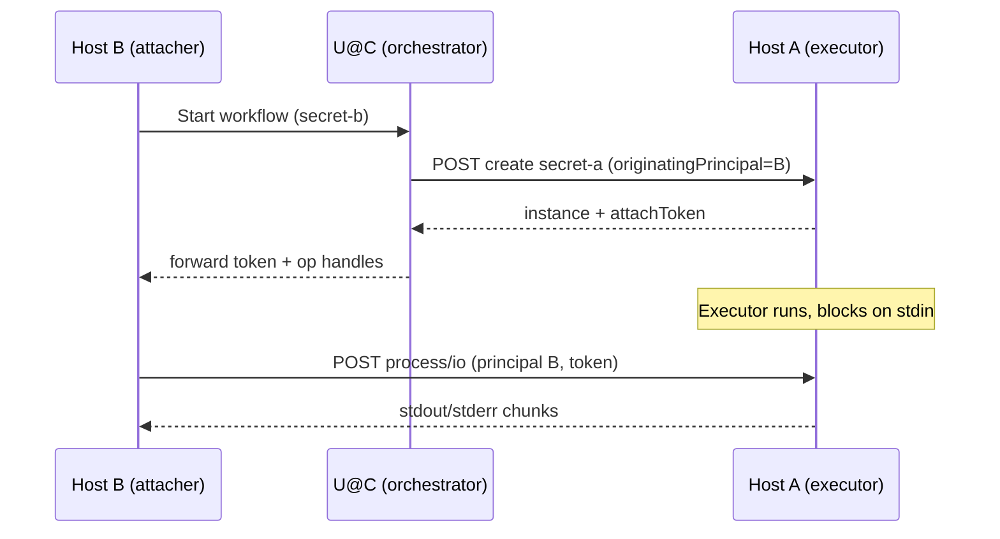

# Process I/O and federated secret operations

> **Deprecated (Sep 2026).** This document describes the superseded `process/io` long-poll
> model and pre-attach-after-POST client flow. **Current architecture:**
> [design.md](design.md), [plan.md](plan.md), [plan-remote.md](plan-remote.md),
> [plan-federation.md](plan-federation.md), [http-api.md](http-api.md).
>
> Federation (parked) uses **introduce** and **pipe**, not the originating-principal /
> attach-token sketches below. Remote HTTP/SSH sessions: [plan-remote.md](plan-remote.md).

Design for stdio attach, multi-secret orchestration, and (later) a second control plane over SSH. Written during design discussion (May 2026).

## Status (historical — not current)

| Area | State at time of writing | Current (Phases 0–7) |
|------|--------------------------|----------------------|
| HTTP stdio (`POST …/process/io`) | Partially implemented | **Removed** — attach-before-start + `Handle` |
| Decoupled start vs attach | Not implemented | **Done** — client attaches, then POST |
| Originating principal + attach token | Designed | **Superseded** — A is starter+attacher on B; John authorises via introduce or pipe ([plan-federation.md](plan-federation.md)) |
| Header-based principal (forward auth) | Designed, deferred | **[plan-remote.md](plan-remote.md)** Phase 1 (`X-Secret-Agent-User`) |
| Embedded SSH server + SSH client | Designed, not started | **Dropped** — OpenSSH + `command=` helper ([plan-remote.md](plan-remote.md) Phases 4–5) |
| Same-host federated e2e (NixOS) | Planned | plan-federation Phase 5 |

## Goals

1. **Interactive and piped I/O** for secret operations without holding secret material in the agent.
2. **Federated secrets**: a “child” secret (e.g. `secret-a`) takes runtime input from a “parent” workflow on another principal/host (e.g. `secret-b` on B), coordinated via an upstream agent (U@C).
3. **Two complete transports** later: HTTP and secret-agent’s **embedded SSH** (not OpenSSH). They share domain logic (`store.Secrets`, SQLite, executor) but do not mix mechanisms on one connection.
4. **Same-host hierarchy first** for PoC and NixOS e2e: identical authorization rules as cross-host, using existing Unix-socket peer credentials (no new auth mechanisms).

## Architecture overview

For **root** (local) secrets, B and U collapse to the same caller: `originatingPrincipal` equals the transport principal, and attach token is optional.

## Control planes

### HTTP (`http://` / local Unix socket)

- Today: single listener on a **Unix domain socket**, identity from **peer credentials** (`SO_PEERCRED`).
- Planned (not blocking PoC): serve HTTP on a socket only Caddy can dial; **principal from a trusted header** set by Caddy forward-auth; remote access as `https://hostname` through the proxy.
- Stdio attach: **byte-oriented** `command.Stdio` over `POST /secrets/{id}/instances/{id}/operations/{n}/process/io` (long-poll style with `maxWait`, byte offsets). Not a PTY.

### SSH (`ssh://user@hostname`) — later

- **secret-agent’s own embedded SSH server**, not OpenSSH on the box.
- Parallel **SSH client** implementing `store.Secrets`.
- **PTY only when a TTY is required** (password prompts, job control, resize). List/get/await/cancel and non-interactive I/O use structured RPC or separate channels—not “everything over one PTY”.
- Attach authorization must use the **same rules** as HTTP (originating `startedBy` + token when applicable).

Do **not** add an ephemeral reverse/forward SSH hop; B reaches A on A’s stable SSH endpoint when that transport is used.

## Principals, `startedBy`, and attach

### One attach rule

**Stdio attach is allowed when the authenticated principal equals the operation’s `startedBy`.**

| Case | Transport caller on A | `startedBy` stored | Who may attach |
|------|------------------------|-------------------|----------------|
| Root / local secret | Alice | Alice | Alice |
| Federated secret | U@C | **B** (originating) | B |

For root secrets, originating and direct principals are the same—behavior matches the current `exchangeStdio` check against `op.startedBy`.

For federated operations, the HTTP/SSH caller to A may be U@C, but **`StartedBy` / `trackOperation.startedBy` must be set from the originating principal B**, not U@C’s transport identity. Audit still records who actually opened the connection if needed (e.g. `forwardedBy: U@C`) without using that for attach.

Implementation note: today `createInstance` sets `parameters.StartedBy` and `trackOperation(...)` from `identity.Principal` only (`internal/server/controller.go`). Federated create must accept an **originating principal** (header or JSON field) that U@C is allowed to assert for that secret.

### Attach token (federated only)

No second *authentication* mechanism: transport auth still identifies the caller.

For federated ops, attach requires:

1. `authenticatedPrincipal == op.startedBy` (B), **and**
2. valid **attach token** issued when A created the op and returned to U@C.

This blocks U@C from attaching after forwarding create: U@C has the token but is not B.

**Token rules** (to implement):

- Bound to `(secretId, instanceId, operationNumber)`.
- Invalidated on cancel or operation completion.
- Carried on attach requests (header or query).
- Returned in the create/start response to the forwarder for relay to B.

Root/local ops: token omitted or ignored; principal == `startedBy` suffices.

### Secret declaration (authorization)

A child secret is declared to take input from a parent, e.g. conceptually: `secret-a` input from `secret-b` on B. That declaration constrains:

- Which **originating principal(s)** U@C may set when starting an op on A.
- Which principal may attach (must match stored `startedBy`).

Policy is **authorization**; peer creds / SSH auth / (later) forward-auth header are **authentication**.

## Lifecycle and races

- The executor may **start immediately** and **block on stdin**; that is expected.
- U@C forwards the attach token to B; B connects to A and unblocks the script via `process/io`.
- If attach never arrives, the process may hang until an **operation timeout** (existing concern, not unique to federation).
- A and B manage their own timeouts; U@C cancel should fan out to both; B should send an **idempotent** cancel to A.

## Cancel

| Actor | Action |
|-------|--------|
| U@C | Cancel operation on A and relevant work on B |
| B | Idempotent cancel on A (safe if U@C already cancelled) |

Cancel on A should tear down stream handles so a late attach fails clearly.

## Same-host degradation

Cross-host (B → U@C → A) and **same-host hierarchy** (B and A on one machine, still separate principals via Unix socket) share the same logic:

- U@C and A can be the same `secret-agent` process with different synthetic principals in tests, or two socket clients as different users.
- Peer credentials remain the auth mechanism for PoC—no Caddy, no header principal, no SSH yet.
- NixOS e2e can model: `secret-b` create triggers forward to `secret-a`, attacher uses a second user/principal + token.

This validates originating `startedBy`, token relay, and decoupled attach before any remote plumbing.

## Current implementation snapshot

**Server** (`internal/server/controller.go`):

- Create/start allocates in-memory `Stream`s for stdin/stdout/stderr and registers them in `operations` via `trackOperation(startedBy, …)`.
- `exchangeStdio` enforces `identity.Principal == op.startedBy`.
- Route: `POST …/operations/{opNumber}/process/io`.

**Client** (`internal/client/client.go`):

- After create/start, `go runStdioExchange(...)` runs in the **same** client call—no split between “starter” and “attacher”.
- Cancel path uses `DELETE …/operations/{n}/cancel` but server registers `DELETE …/operations/{n}/process` — needs alignment.

**Tests**: `nix/checks/stdio.nix` covers local CLI stdin/stdout/stderr through the agent in one process; not yet federated attach.

---

## First steps (implementation plan)

Ordered for a **PoC**: finish HTTP stdio attach and same-host federated flow without new auth mechanisms. SSH and Caddy/header principal are explicitly out of scope until this passes e2e.

### Phase 0 — Fix and harden existing HTTP attach

1. **Align cancel route** between client and server (`/process` vs `/cancel`).
2. **Confirm CLI path**: ensure `secret-agent create` with piped stdin/stdout still works end-to-end via `process/io` (extend `stdio.nix` if gaps found).
3. **Document attach API** in code comments: query params (`stdinToByte`, `stdoutFromByte`, `stderrFromByte`, `stdinComplete`, `maxWait`, `maxBytes`), JSON response shape (`StdioResponse`).

### Phase 1 — Decouple operation start from stdio attach

Goal: U@C can start an op on A without holding stdio; B attaches later.

1. **Server**
   - On create/start response, include `attachToken` (random, stored on `operation` struct) when the secret config marks the op as federated (or always return token; root clients may ignore it).
   - `exchangeStdio`: require token match when op has a non-empty token; keep `principal == op.startedBy`.
   - Accept **originating principal** on create/start:
     - JSON field e.g. `originatingPrincipal` on `OperationParameters`, **or**
     - header e.g. `X-Secret-Agent-Originating-Principal` (for same shape as future forward-auth).
   - Validate: if originating principal is set and ≠ transport principal, check secret policy allows U@C to act for that origin.
   - Set `executor.OperationParameters.StartedBy` and `trackOperation.startedBy` to **originating** principal when provided, else transport principal.

2. **Client**
   - Split `Create` / `startOperation`:
     - `Start…` (or option `Attach: false`) — returns instance + token, does **not** spawn `runStdioExchange`.
     - `AttachStdio(ctx, instance, opNumber, token, stdio)` — runs exchange loop only.
   - Keep convenience wrapper: local create with stdio = start + attach in one call (root secrets).

3. **Tests (Go)**
   - Controller: U@C principal starts with `originatingPrincipal: B` → attach as B + token succeeds; attach as U@C or B without token fails.
   - Controller: root secret without originating → attach as starter only.

### Phase 2 — Same-host federated NixOS e2e

1. **NixOS module / test secrets** (new check e.g. `nix/checks/federated-stdio.nix`):
   - `secret-b` create script calls into agent API (or CLI) to start `secret-a` via a designated “orchestrator” user, passing originating principal for `secret-b-runner`.
   - `secret-a` create blocks on stdin (e.g. `cat > /tmp/proof`).
   - Runner user cannot attach (wrong principal); `secret-b-runner` attaches with token and supplies input.
2. **Permissions**: map test users to principals in `permissions.json`; document test principal names in the check.
3. Optional: **orchestrator user** = peer that may set originating principal for `secret-a` only.

### Phase 3 — Orchestration glue (still same-host)

1. Minimal **forwarding helper** in client or CLI: given parent op context, call child create with originating principal + return token to caller.
2. **Cancel fan-out** test: cancel parent workflow → child op on A cancelled; B’s idempotent cancel to A.

### Deferred (after PoC green)

| Item | Notes |
|------|--------|
| Header principal from Caddy | Trust boundary: only proxy dials Unix socket |
| Embedded SSH server | Same attach gate + token; PTY for TTY-only |
| Cross-host networking | Same logic; transport auth differs per host |
| Operation / attach timeouts | Tune policies; not blocking initial e2e |
| `await` route | Client references `…/await`; verify server exposes it or add handler |

## Open questions

- Exact schema for “`secret-a` input from `secret-b` on B” in `secrets.Secret` (field names, validation).
- Whether attach token is single-use or valid for the whole op until complete.
- How `secret-agent` CLI exposes split start/attach for debugging vs single-shot for root secrets.

## References

- `internal/server/controller.go` — `trackOperation`, `exchangeStdio`, create/start handlers
- `internal/client/client.go` — `runStdioExchange`
- `internal/store/store.go` — `Instances` + `command.Stdio`
- `nix/checks/stdio.nix` — local stdio wiring
